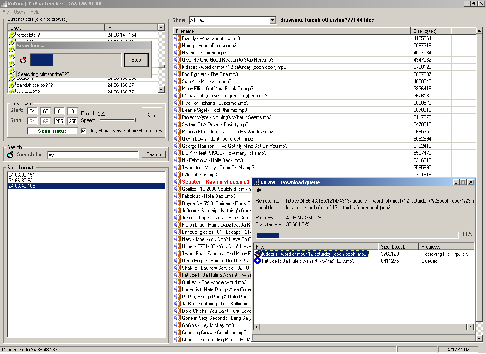



## KuDos \- KaZaa Leecher

### Description

Download files from KaZaa users without having to be connected to the KaZaa network. Features include: Search, Browsing, Download queue, etc. Currently only downloades one file at a time but you can add multiple files to a queue so that they will be downloaded automatically. You also have the ability to send KuDos to the system try while downloading. I used the IP Scanner code from James (A little buggy but thanks | http://www.pscode.com/vb/scripts/ShowCode.asp?txtCodeId=32384&lngWId=1) and I used the Downloader OCX provided by Sean (Awsome code! | http://www.pscode.com/vb/scripts/ShowCode.asp?txtCodeId=23693&lngWId=1). I also used a Tray Icon Module (can't remember where I got it :( sorry). Could be improved by adding a faster search, multiple download's, etc. Oh Ya, Please vote `,:0)
 
### More Info
 
I have included all icons/bas modules with zip. Might need to download the Downloader OCX which can be found here: http://www.pscode.com/vb/scripts/ShowCode.asp?txtCodeId=23693&lngWId=1

             |
---                |---
**Submitted On**   |2002-04-17 11:31:48
**By**             |[Tom Bishop](https://github.com/Planet-Source-Code/PSCIndex/blob/master/ByAuthor/tom-bishop.md)
**Level**          |Intermediate
**User Rating**    |4.8 (48 globes from 10 users)
**Compatibility**  |VB 5\.0, VB 6\.0
**Category**       |[Internet/ HTML](https://github.com/Planet-Source-Code/PSCIndex/blob/master/ByCategory/internet-html__1-34.md)
**World**          |[Visual Basic](https://github.com/Planet-Source-Code/PSCIndex/blob/master/ByWorld/visual-basic.md)
**Archive File**   |[KuDos\_\-\_Ka729674172002\.zip](https://github.com/Planet-Source-Code/tom-bishop-kudos-kazaa-leecher__1-33886/archive/master.zip)

